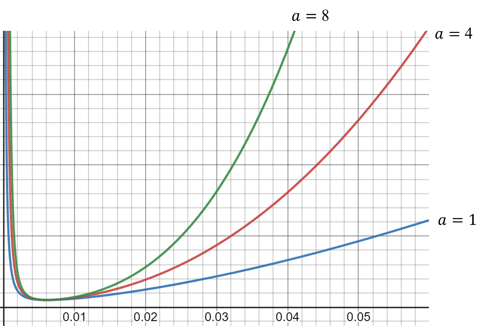

# SwooshActivationFunction

## Swoosh Activation Function
SAF is introduced to optimize predicted landmark detection heatmaps by enforcing an optimum mean squared error (MSE) between a pair of predicted heatmaps. It also enforces a secondary optimum MSE between a predicted heatmap and a zero matrix. 

The formula of SAF is:
$$
f(x>0) = \left(ax + \frac{1}{bx}\right)^c - Min
$$

The figure of SAF without the Min term is:

Configuring SAF requires following steps:
1. Determine the MSE between a pair of ground truth heatmap.
2. Determine the value of coefficient a which determines the slope of SAF around the minimum point in Quadrant 1 of the Cartesian coordinate system.
3. Compute coefficient b using equation: $$b = \frac{1}{a\times Optimum MSE^2}$$
4. Compute coefficient c using equation: $$c = \frac{\log(Min)}{\log(\frac{ax^2+1}{bx})}, x = 0.0061$$

Citation: TBD
